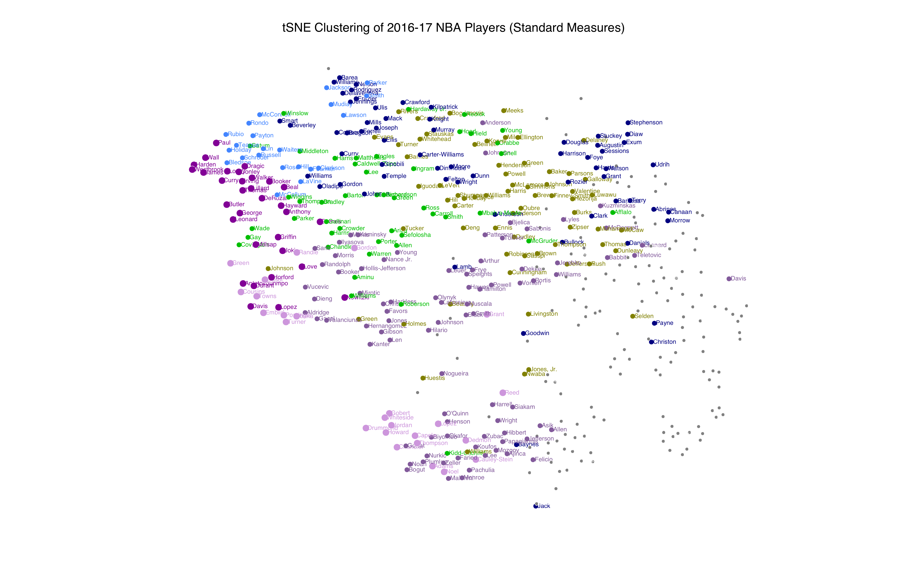

### tSNE

tSNE plot:

This is a plot that graphs players using standard box score measures (points, rebounds, assists, steals, blocks, turnovers, FG%, 3P%, FT%), comparing how well these players fare in each metric are to the “league average” using z-scores, followed by applying the t-SNE (t-distributed stochastic neighbor embedding) algorithm that clusters players together by similarity based off of their z-scores for each box score measure.  

This plot contains the following player types:  
* "Star" playmaking players or primary scoring options (purple)
* Starting or second unit big men (lavender)
* Athletic or versatile or effective big men (pink)
* Primary team ballhandlers  (light blue)
* Secondary ballhandlers/guards (navy)
* Starting wings  (green)
* Secondary wings (olive)
* Non-impact players (gray)
  * For players who did not play significant minutes for their teams, i.e. called up from G-League, played one game and got injured, fringe rotation players, and or frequent DNPs.
   * Examples include Edy Tavares, Anthony Bennett, Jordan Farmar, Paul Pierce.

The plot clusters star players like John Wall, LeBron James, Stephen Curry, James Harden, and Russell Westbrook close together.

The plot also groups other stars close together such as Jimmy Butler, Paul George, and Kawhi Leonard.

It also groups Giannis Antetokounmpo, Kevin Durant, DeMarcus Cousins, Karl-Anthony Towns, and Anthony Davis as similar players. This could be due to the fact that Giannis & KD are efficient scoring players similar (and physically similar) to versatile big men such as Towns, Cousins and Davis.

At the bottom of the figure shows mostly centers, with the group of Andre Drummond, Dwight Howard, DeAndre Jordan, Hassan Whiteside, Rudy Gobert exemplifying the athletic, rim-running, defensive presence needed in the today's NBA.

Primary team ballhandlers show up such as T.J. McConnell, Ricky Rubio, Jeff Teague, Elfrid Payton, and Eric Bledsoe. Secondary ball handlers like Patty Mills, Cory Joseph, Shelvin Mack are grouped close together, with other players such as Jamal Crawford, Tim Hardaway Jr., and Austin Rivers being closeby.

Towards the center of this graph it has the perimeter-oriented big men such as Marreese Speights, Spencer Hawes, Channing Frye.
